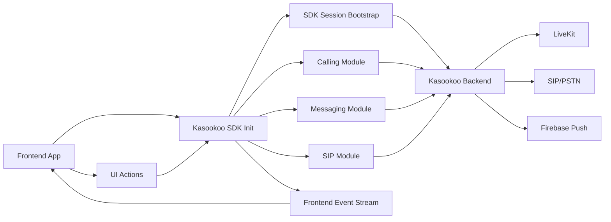

# Business Requirements Document (BRD)
# Kasookoo Frontend SDK Communication Platform

## 1) Purpose

This project provides a shared backend platform that enables frontend applications to offer:

- Real-time app-to-app calling (WebRTC to WebRTC)
- App-to-phone/business calling (WebRTC to SIP)
- Instant messaging (LiveKit-based)
- Push notifications (Firebase)

The platform is **multi-tenant**, meaning multiple client organizations can use the same system while keeping their data and settings separated.

## 2) Business Objectives

- Deliver a ready communication layer for frontend products.
- Reduce time to launch calling and messaging features.
- Support both internet calling and phone network integration.
- Provide organization-level control, security, and reporting.
- Improve end-user engagement through instant communication and alerts.

## 3) Stakeholders

- Product Owners / Business Managers
- Client Organization Admins (tenants)
- Frontend Application Teams
- Operations / Support Teams
- End Users (agents, customers, staff)

## 4) Scope

### In Scope

- Multi-tenant organization onboarding and configuration
- SDK session/token issuance for frontend usage
- WebRTC app-to-app calling
- WebRTC-to-SIP calling
- Instant messaging and conversation management
- Firebase push notifications for call/message events
- Call/session data persistence and dashboard/record visibility

### Out of Scope

- Billing and payment management
- CRM workflows not related to communication events
- End-user identity provider implementation beyond configured auth model
- Custom telecom provisioning outside SIP integration settings

## 5) Functional Requirements

### A. Multi-Tenant Management

- The system must support multiple organizations on one shared platform.
- Each organization must have isolated users, communication data, and configuration.
- Organization-level communication settings must be manageable by authorized admins.

### B. SDK Access and Session Control

- Frontend SDK access must use backend-issued short-lived sessions/tokens.
- The system must allow secure token minting and session revocation.
- Feature access must be controlled by permissions/scopes.

### C. WebRTC to WebRTC Calling

- Users must be able to initiate and receive in-app audio/video calls.
- The system must track call lifecycle states (initiated, ringing, connected, ended, rejected).
- Active calls and call history must be retrievable.
- Real-time status updates should be available for clients.
- Optional call recording should be supported where enabled.

### D. WebRTC to SIP Calling

- Users must be able to place calls from app to SIP/phone endpoints.
- SIP call routing must use organization-specific SIP/trunk settings.
- Call hangup/end controls must be supported.
- Inbound SIP call mapping/routing should support tenant-defined user association.

### E. Instant Messaging

- Users must be able to exchange one-to-one messages in real time.
- The system must persist conversation and message history.
- Conversation listing, unread counts, and read-state updates must be supported.
- Message delivery should optionally trigger push notifications.

### F. Push Notifications (Firebase)

- Client devices must be registerable for notifications.
- The system must send push alerts for key events:
  - incoming call
  - call ended/rejected/missed events
  - new message
- The system should continue core communication flows even if notifications are temporarily unavailable.

### G. Reporting and Operational Visibility

- The platform should provide call records and summary metrics at organization level.
- Admin-facing visibility should support monitoring and support operations.

## 6) SDK Configuration Requirements

### A. Tenant Configuration

- Each frontend integration must include organization context.
- SDK activity must be traceable to tenant and user/session context.

### B. Security Configuration

- Token issuer, audience, session duration, and allowed scopes must be configurable.
- Public keys/secrets required for token validation/signing must be managed securely.

### C. LiveKit Configuration

- LiveKit endpoint and credentials must be configured.
- Configuration must support room/token workflows for call and messaging sessions.

### D. SIP Configuration

- SIP trunk and outbound/inbound settings must be configurable per organization.
- Routing behavior for PSTN/SIP calls must align with tenant setup.

### E. Firebase Configuration

- Firebase credentials/project setup must be configured.
- Device token registration lifecycle (add/update/remove) must be supported.

### F. Data Configuration

- MongoDB connection must be configured for persistent storage.
- Optional recording storage configuration (e.g., S3) must be supported where recording is enabled.

## 7) Key User Journeys

### End User Journey: App-to-App Calling

1. User opens app and receives SDK session.
2. User starts/receives call.
3. Call state updates in real time.
4. Call ends; call details are stored.
5. Optional recording and notifications are processed.

### End User Journey: App-to-Phone Calling

1. User starts SIP-enabled call from app.
2. Platform routes call using tenant SIP configuration.
3. User ends call; call status and records update.

### End User Journey: Messaging

1. User opens chat and obtains messaging access.
2. User sends/receives messages.
3. Conversation history and unread counts update.
4. Recipient may receive push notification.

### Admin Journey: Tenant Operations

1. Admin sets up organization and communication configuration.
2. Admin manages users and related routing/mapping settings.
3. Admin reviews call records and high-level usage metrics.

## 8) Non-Functional Requirements (High-Level)

- **Security:** tenant isolation, token-based access, controlled permissions.
- **Reliability:** core call/message APIs available even when optional services degrade.
- **Scalability:** support multiple organizations and concurrent communication sessions.
- **Observability:** logs, call records, and monitoring visibility for support teams.
- **Maintainability:** centralized backend configuration for all frontend SDK consumers.

## 9) Dependencies

- LiveKit (real-time calling/messaging token workflows)
- SIP provider/trunk configuration
- Firebase Cloud Messaging
- MongoDB persistence layer
- Optional object storage for recordings

## 10) Assumptions

- Frontend apps integrate through provided SDK/API contracts.
- Each customer organization has valid communication provider credentials where required.
- Push notifications are dependent on proper device registration and platform permissions.
- SIP calling quality/availability depends partly on external telecom/SIP providers.

## 11) Success Criteria

- Organizations can be onboarded and configured without code changes.
- Frontend teams can complete SDK integration and start call/message workflows.
- End users can reliably complete app-to-app and app-to-phone calls.
- Messaging and notification experiences work consistently for active users.
- Admins can view tenant-level communication activity and operational summaries.

## 12) Frontend App SDK Overview (Clerk/Stripe Style)

### A. Product Positioning

- The Kasookoo SDK should be consumed by frontend apps as a productized client library, similar to Clerk or Stripe SDK usage patterns.
- Frontend teams integrate a simple SDK interface (initialize, identify user, call, message, listen to events) rather than manually orchestrating backend communication details.
- Backend token and session complexity should be handled internally by the SDK integration layer.

### B. Frontend Developer Experience Goals

- One-time SDK initialization at app startup.
- Minimal configuration to enable calling, messaging, SIP, and notifications.
- Clear lifecycle methods (`init`, `connect`, `disconnect`, `destroy`).
- Event-driven hooks for UI state updates.
- Automatic token/session refresh without frontend developers managing JWT internals directly.

### C. Required SDK Initialization Configuration

Frontend app teams should provide:

- `publishableKey` (public SDK key for frontend initialization)
- `organizationId` (tenant context)
- `environment` (dev/stage/prod)
- `region` (optional, if multi-region routing is used)
- `features` (enable calling, messaging, SIP, recording)
- `userMode` (guest or authenticated user)
- `debug` (optional logging mode)

### D. Logical SDK Initialization Example

```javascript
KasookooSDK.init({
  publishableKey: "pk_live_xxx",
  organizationId: "org_123",
  environment: "production",
  userMode: "guest",
  features: {
    calling: true,
    messaging: true,
    sipCalling: true,
    pushNotifications: true
  }
});
```

### E. Core SDK Functional Surface (Business View)

- **Session management**
  - Acquire and maintain active communication session.
  - Refresh session automatically before expiry.
  - Expose session status to UI.

- **Calling**
  - Start/accept/end app-to-app calls.
  - Support app-to-SIP calls where enabled.
  - Emit call lifecycle events to frontend screens.

- **Messaging**
  - Initialize messaging context.
  - Send/receive real-time messages.
  - Provide unread counts and conversation updates.

- **Notifications**
  - Register device push token through SDK.
  - Deliver incoming call and message notification events.

### F. Suggested Frontend Integration Lifecycle

1. App starts and initializes SDK with publishable config.
2. SDK establishes session in background for current user mode.
3. Frontend binds UI to SDK events (call state, message received, connection state).
4. User performs communication actions through SDK methods.
5. SDK handles backend communication, token rotation, and retries transparently.
6. App closes/logout triggers SDK cleanup and session release.

### G. Event Model for Frontend UX

The SDK should provide a consistent event model, for example:

- `sdk.ready`
- `sdk.connection.changed`
- `call.incoming`
- `call.connected`
- `call.ended`
- `message.received`
- `message.read`
- `notification.received`
- `error`

### H. Responsibilities Split (Important)

- **Frontend app team**
  - Integrates SDK UI flows.
  - Supplies initialization config and user context.
  - Listens and reacts to SDK events.

- **Kasookoo SDK**
  - Manages communication session and backend orchestration.
  - Handles token/session renewal.
  - Provides stable APIs for calling, messaging, and SIP actions.

- **Kasookoo backend**
  - Enforces security, tenancy, and permissions.
  - Executes call/message/notification workflows.
  - Persists operational records.

### I. High-Level SDK Architecture Flow



### J. Non-Technical Success Criteria for SDK Adoption

- Frontend teams can integrate core communication features with low implementation effort.
- Frontend developers do not need to handle low-level token mechanics manually.
- SDK behavior is consistent across guest and authenticated modes.
- UI teams can rely on stable SDK events to build communication experiences quickly.

## 13) Recommended Public SDK API Contract

### A. SDK Initialization and Lifecycle

Recommended public methods:

- `KasookooSDK.init(config)` - initialize SDK with tenant and environment settings
- `KasookooSDK.identify(userContext)` - set current user/guest context
- `KasookooSDK.connect()` - establish active communication session
- `KasookooSDK.disconnect()` - close active communication session
- `KasookooSDK.destroy()` - cleanup SDK resources on app unload/logout
- `KasookooSDK.getState()` - return current SDK state snapshot

### B. Calling Module Contract

Recommended methods:

- `KasookooSDK.call.start(params)` - start app-to-app call
- `KasookooSDK.call.accept(callId)` - accept incoming call
- `KasookooSDK.call.reject(callId, reason)` - reject incoming call
- `KasookooSDK.call.end(callId)` - end active call
- `KasookooSDK.call.mute(audioMuted)` - toggle local audio mute
- `KasookooSDK.call.getActiveCall()` - fetch current active call object

### C. SIP Calling Module Contract

Recommended methods:

- `KasookooSDK.sip.dial({ phoneNumber, displayName })` - start app-to-phone call
- `KasookooSDK.sip.hangup(callId)` - end SIP call
- `KasookooSDK.sip.getStatus(callId)` - fetch SIP call status

### D. Messaging Module Contract

Recommended methods:

- `KasookooSDK.messaging.connect()` - initialize messaging session
- `KasookooSDK.messaging.send({ toUserId, message, metadata })` - send message
- `KasookooSDK.messaging.listConversations(filters)` - list user conversations
- `KasookooSDK.messaging.getMessages(conversationId, paging)` - fetch message history
- `KasookooSDK.messaging.markRead(conversationId)` - mark conversation as read
- `KasookooSDK.messaging.getUnreadCount()` - return unread counters

### E. Notification Module Contract

Recommended methods:

- `KasookooSDK.notifications.registerDevice(pushToken, platform)` - register device token
- `KasookooSDK.notifications.unregisterDevice(pushToken)` - remove device token
- `KasookooSDK.notifications.getPermissionState()` - read local notification permission status

### F. Event Contract (Frontend Subscription Model)

Recommended listener interface:

- `KasookooSDK.on(eventName, handler)`
- `KasookooSDK.off(eventName, handler)`

Recommended event names:

- `sdk.ready`
- `sdk.connection.changed`
- `sdk.error`
- `session.expiring`
- `session.refreshed`
- `session.expired`
- `call.incoming`
- `call.ringing`
- `call.connected`
- `call.ended`
- `call.failed`
- `sip.calling`
- `sip.connected`
- `sip.ended`
- `message.received`
- `message.sent`
- `message.read`
- `conversation.updated`
- `notification.received`

### G. Standard Response Shape (Recommended)

Recommended standardized SDK response envelope:

```json
{
  "success": true,
  "data": {},
  "error": null,
  "requestId": "req_xxx",
  "timestamp": "2026-04-27T12:00:00Z"
}
```

### H. Standard Error Model (Recommended)

Recommended normalized SDK error structure:

```json
{
  "success": false,
  "data": null,
  "error": {
    "code": "SESSION_EXPIRED",
    "message": "Session expired. Please reconnect.",
    "retryable": true
  },
  "requestId": "req_xxx",
  "timestamp": "2026-04-27T12:00:00Z"
}
```

### I. Configuration Object (Recommended)

```javascript
const kasookooConfig = {
  publishableKey: "pk_live_xxx",
  organizationId: "org_123",
  environment: "production",
  region: "eu-west-1",
  userMode: "guest",
  features: {
    calling: true,
    messaging: true,
    sipCalling: true,
    pushNotifications: true,
    recording: false
  },
  logging: {
    level: "info",
    enableConsole: false
  }
};
```

### J. Adoption Guideline

- Keep SDK public API stable and versioned (semantic versioning).
- Introduce new capabilities as additive methods/events to avoid frontend breaking changes.
- Mark deprecated methods with migration path and removal timeline.
- Maintain consistent naming across web, Android, and iOS SDK variants.

## 14) v1 MVP SDK Contract (Launch-Safe Minimum)

### A. Objective

- Define the smallest stable SDK surface needed for first production launch.
- Prioritize app-to-app calling, basic messaging, and essential session handling.
- Keep SIP and advanced features optional for post-v1 expansion.

### B. Required v1 Initialization Contract

- `KasookooSDK.init(config)`
- `KasookooSDK.connect()`
- `KasookooSDK.disconnect()`
- `KasookooSDK.getState()`

Minimum config fields:

- `publishableKey`
- `organizationId`
- `environment`
- `userMode`
- `features.calling`
- `features.messaging`

### C. Required v1 Calling Contract

- `KasookooSDK.call.start(params)`
- `KasookooSDK.call.accept(callId)`
- `KasookooSDK.call.reject(callId, reason)`
- `KasookooSDK.call.end(callId)`
- `KasookooSDK.call.getActiveCall()`

### D. Required v1 Messaging Contract

- `KasookooSDK.messaging.connect()`
- `KasookooSDK.messaging.send({ toUserId, message })`
- `KasookooSDK.messaging.listConversations()`
- `KasookooSDK.messaging.getMessages(conversationId)`
- `KasookooSDK.messaging.markRead(conversationId)`
- `KasookooSDK.messaging.getUnreadCount()`

### E. Optional in v1 (Feature Flag Based)

- SIP calling module (`KasookooSDK.sip.*`)
- Push device registration helpers
- Recording controls

### F. Required v1 Events

- `sdk.ready`
- `sdk.connection.changed`
- `sdk.error`
- `session.expiring`
- `session.refreshed`
- `call.incoming`
- `call.connected`
- `call.ended`
- `message.received`
- `conversation.updated`

### G. Required v1 Error Codes

- `SESSION_EXPIRED`
- `SESSION_INVALID`
- `PERMISSION_DENIED`
- `CALL_FAILED`
- `MESSAGE_SEND_FAILED`
- `NETWORK_UNAVAILABLE`

### H. v1 Launch Acceptance Criteria

- App-to-app call flow works end-to-end with stable event updates.
- Messaging send/receive/unread flows work end-to-end.
- Session refresh happens automatically without user interruption.
- Error model is consistent and actionable for frontend UI handling.
