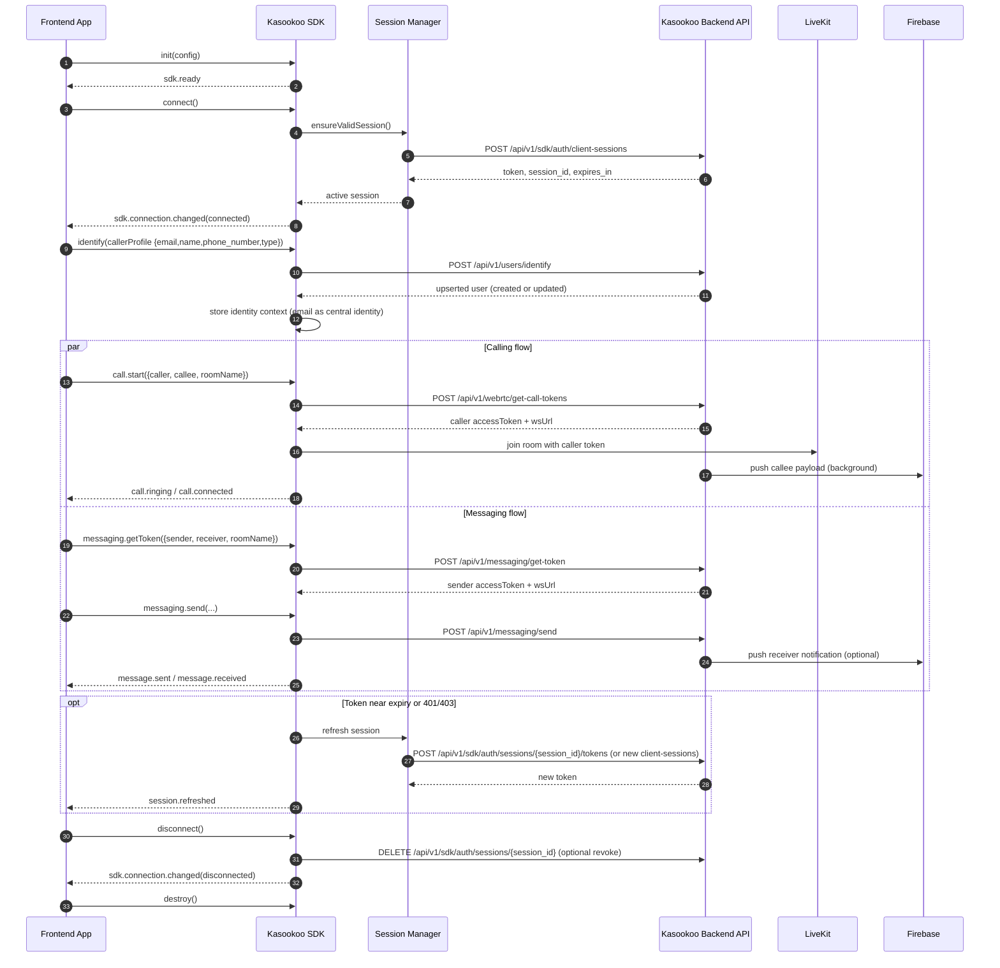

# SDK Developer Implementation Guide
# Kasookoo SDK for React, Kotlin, and Swift

## 1) Purpose

This document explains how SDK developers should implement Kasookoo frontend SDKs that consume Kasookoo backend APIs using the agreed contract model.

It is intended for teams building:

- React SDK (Web)
- Kotlin SDK (Android)
- Swift SDK (iOS)

## 2) Scope and Principles

### In Scope

- SDK architecture and module boundaries
- Session/token handling model
- Backend API interaction contract
- Event model and error model
- Platform implementation guidance (React/Kotlin/Swift)

### Core Principles

- SDK must hide backend API complexity from app teams.
- SDK must expose stable, product-style APIs (similar to Stripe/Clerk developer experience).
- SDK must manage session renewal automatically.
- SDK must provide consistent behavior and naming across platforms.
- SDK must be backward-compatible for minor versions.

## 3) Backend API Consumption Model

SDKs should consume backend APIs through an internal API client layer. App teams should not directly manage backend endpoint orchestration.

### Required Backend Flows

1. Session bootstrap:
   - `POST /api/v1/sdk/auth/client-sessions`
2. Session rotation (optional but recommended):
   - `POST /api/v1/sdk/auth/sessions/{session_id}/tokens`
3. Session revoke:
   - `DELETE /api/v1/sdk/auth/sessions/{session_id}`
4. Calling:
   - `POST /api/v1/webrtc/get-call-tokens` (recommended explicit caller/callee flow)
   - `POST /api/v1/webrtc/get-call-tokens-anonymous` (anonymous caller flow)
   - `POST /api/v1/webrtc/calls/{room_name}/end`
5. SIP:
   - `POST /api/v1/sip/calls/dial`
   - `POST /api/v1/sip/calls/hangup`
6. Messaging:
   - `POST /api/v1/messaging/get-token`
   - `POST /api/v1/messaging/send`
7. Optional push registration:
   - notification register/unregister endpoints exposed by backend notification module

## 4) Public SDK Contract (Recommended)

### Lifecycle

- `init(config)`
- `connect()`
- `disconnect()`
- `destroy()`
- `getState()`

### Identity

- `identify(callerProfile)`
- `clearIdentity()`

### Calling

- `call.start(params)`
- `call.accept(callId)`
- `call.reject(callId, reason)`
- `call.end(callId)`
- `call.getActiveCall()`

### SIP

- `sip.dial(params)`
- `sip.hangup(callId)`
- `sip.getStatus(callId)`

### Messaging

- `messaging.connect()`
- `messaging.send(params)`
- `messaging.listConversations(filters)`
- `messaging.getMessages(conversationId, paging)`
- `messaging.markRead(conversationId)`
- `messaging.getUnreadCount()`

### Notifications

- `notifications.registerDevice(pushToken, platform)`
- `notifications.unregisterDevice(pushToken)`

## 5) Initialization Contract

SDK should support this configuration structure:

```json
{
  "publishableKey": "pk_live_xxx",
  "organizationId": "org_123",
  "environment": "production",
  "region": "eu-west-1",
  "userMode": "guest",
  "features": {
    "calling": true,
    "messaging": true,
    "sipCalling": true,
    "pushNotifications": true,
    "recording": false
  },
  "logging": {
    "level": "info",
    "enableConsole": false
  }
}
```

Validation requirements:

- `publishableKey`, `organizationId`, `environment` are mandatory.
- `features` default to safe values when omitted.
- SDK must fail fast with clear validation error codes for invalid config.

## 6) Session and Token Management Rules

- SDK must acquire session/token during `connect()` or lazy on first protected action.
- SDK must store short-lived token in secure memory (not long-term plain storage).
- SDK must renew token before expiry (recommended threshold: 80-90% of TTL).
- On `401/403`, SDK should refresh session and retry once.
- SDK must emit session lifecycle events:
  - `session.expiring`
  - `session.refreshed`
  - `session.expired`

## 7) Event Contract (Cross-Platform Consistency)

Required event names:

- `sdk.ready`
- `sdk.connection.changed`
- `sdk.error`
- `session.expiring`
- `session.refreshed`
- `session.expired`
- `call.incoming`
- `call.ringing`
- `call.connected`
- `call.ended`
- `call.failed`
- `sip.calling`
- `sip.connected`
- `sip.ended`
- `message.received`
- `message.sent`
- `message.read`
- `conversation.updated`
- `notification.received`

Each event payload should include:

- `eventId`
- `timestamp`
- `organizationId`
- `userEmail` (central identity)
- `data` object (module-specific)

## 8) Error Model

SDK must normalize backend and network errors into a shared model:

```json
{
  "code": "SESSION_EXPIRED",
  "message": "Session expired. Please reconnect.",
  "retryable": true,
  "httpStatus": 401,
  "requestId": "req_xxx",
  "details": {}
}
```

Required minimum error codes:

- `CONFIG_INVALID`
- `SESSION_EXPIRED`
- `SESSION_INVALID`
- `PERMISSION_DENIED`
- `NETWORK_UNAVAILABLE`
- `CALL_FAILED`
- `MESSAGE_SEND_FAILED`
- `UNKNOWN_ERROR`

## 9) Reference SDK Internal Architecture

Recommended internal modules for all platforms:

- `ConfigManager`
- `ApiClient`
- `SessionManager`
- `EventBus`
- `CallService`
- `SipService`
- `MessagingService`
- `NotificationService`
- `StateStore`
- `Logger`

Dependency rule:

- Public SDK facade -> service modules -> API client -> backend endpoints

## 10) React SDK Implementation Guidance

### Packaging

- Package: `@kasookoo/sdk-react` (or `@kasookoo/sdk-web`)
- Build outputs: ESM + CJS + type definitions

### Integration style

- Primary class API: `KasookooSDK`
- Optional React helpers:
  - `KasookooProvider`
  - `useKasookoo()`
  - `useKasookooCall()`
  - `useKasookooMessaging()`

### Runtime requirements

- Browser compatibility target defined (modern evergreen browsers)
- WebSocket and WebRTC support checks with graceful fallback behavior

### Storage/Security

- Keep active token in memory first.
- If persistence is required, use secure, minimal storage and rotate often.

## 11) Kotlin SDK (Android) Implementation Guidance

### Packaging

- Library module: `com.kasookoo:sdk-android`
- Publish as AAR with semantic versions

### Core technologies

- HTTP: OkHttp + Retrofit (recommended)
- Concurrency: Kotlin Coroutines + Flow

### API surface

- Main entry: `KasookooSdk.init(context, config)`
- Event streams via `Flow<SDKEvent>`
- Suspend functions for async operations

### Android specifics

- Handle app lifecycle transitions (foreground/background) gracefully.
- Support FCM device token registration through SDK notification module.
- Use encrypted/shared preferences only when persistence is required.

## 12) Swift SDK (iOS) Implementation Guidance

### Packaging

- Swift Package Manager package: `KasookooSDK`

### Core technologies

- HTTP: `URLSession`
- Concurrency: Swift async/await
- Event distribution: Combine and/or delegate callbacks

### API surface

- Main entry: `KasookooSDK.initialize(config:)`
- Async methods for session, call, and messaging operations
- Event delivery via typed callbacks or Combine publishers

### iOS specifics

- Integrate APNs token registration through notification module.
- Use Keychain for sensitive token persistence when needed.
- Ensure thread-safe state updates for UI-facing events.

## 13) API Retry, Timeout, and Resilience Rules

- Define default timeout per request class (session, call, messaging).
- Use exponential backoff for retryable failures.
- Do not retry non-retryable business errors.
- Retry idempotent requests safely; avoid duplicate side effects.
- Include request correlation IDs for observability.

## 14) Versioning and Compatibility

- Use semantic versioning across all SDKs.
- Keep method and event names aligned across React/Kotlin/Swift.
- Avoid breaking changes in minor/patch releases.
- Provide migration notes for any deprecations.

## 15) QA and Release Readiness Checklist

- End-to-end session bootstrap and refresh tested.
- WebRTC call start/accept/end verified.
- Messaging send/receive/read verified.
- SIP dial/hangup verified (if feature enabled).
- Event contract parity verified across all three SDKs.
- Error code mapping validated against backend responses.
- Documentation and sample apps available for each platform.

## 16) Sample Cross-Platform Usage Pattern

Shared logical flow for app teams:

1. Initialize SDK with project config.
2. Identify guest/user context.
3. Connect SDK session.
4. Subscribe to events for UI updates.
5. Call SDK methods for calling/messaging/SIP.
6. Handle SDK normalized errors.
7. Disconnect and destroy on logout/app close.

This ensures frontend teams focus on UX while SDK handles backend orchestration.

## 17) SDK Sample Code (React, Kotlin, Swift)

### A. React (Web) - Basic Initialization and Usage

```typescript
import { KasookooSDK } from "@kasookoo/sdk-react";

const sdk = new KasookooSDK();

await sdk.init({
  publishableKey: "pk_live_xxx",
  organizationId: "org_123",
  environment: "production",
  userMode: "guest",
  features: {
    calling: true,
    messaging: true,
    sipCalling: true,
    pushNotifications: true
  }
});

await sdk.identify({
  name: "John Caller",
  email: "john.caller@example.com",
  phoneNumber: "+447700900111",
  type: "customer"
});

await sdk.connect();

sdk.on("sdk.ready", () => console.log("Kasookoo SDK is ready"));
sdk.on("call.incoming", (event) => console.log("Incoming call:", event.data));
sdk.on("message.received", (event) => console.log("New message:", event.data));
sdk.on("sdk.error", (event) => console.error("SDK error:", event));

// Start app-to-app call using caller/callee objects (matches /webrtc/get-call-tokens)
await sdk.call.start({
  roomName: "support-room-123",
  isPushNotification: true,
  isCallRecording: false,
  caller: {
    name: "John Caller",
    email: "john.caller@example.com",
    phoneNumber: "+447700900111",
    type: "customer"
  },
  callee: {
    name: "Sarah Agent",
    email: "sarah.agent@example.com",
    phoneNumber: "+447700900222",
    type: "agent"
  }
});

// Get messaging token using sender/receiver objects (matches /messaging/get-token)
await sdk.messaging.getToken({
  roomName: "chat-room-123",
  isPushNotification: true,
  sender: {
    name: "John Caller",
    email: "john.caller@example.com",
    phoneNumber: "+447700900111",
    type: "customer"
  },
  receiver: {
    name: "Sarah Agent",
    email: "sarah.agent@example.com",
    phoneNumber: "+447700900222",
    type: "agent"
  }
});

// Send chat message after token/session setup
await sdk.messaging.send({
  roomName: "chat-room-123",
  senderEmail: "john.caller@example.com",
  receiverEmail: "sarah.agent@example.com",
  message: "Hello, I need support.",
  messageType: "text",
  isPushNotification: true
});
```

### B. React Hook-Style Wrapper Example

```typescript
import { useEffect } from "react";
import { useKasookoo } from "@kasookoo/sdk-react";

export function SupportWidget() {
  const sdk = useKasookoo();

  useEffect(() => {
    const onConnected = () => console.log("Connected");
    const onCallEnded = (event: any) => console.log("Call ended", event.data);

    sdk.on("sdk.connection.changed", onConnected);
    sdk.on("call.ended", onCallEnded);

    return () => {
      sdk.off("sdk.connection.changed", onConnected);
      sdk.off("call.ended", onCallEnded);
    };
  }, [sdk]);

  return null;
}
```

### C. Kotlin (Android) - Initialization and Event Flow

```kotlin
val sdk = KasookooSdk()

sdk.init(
    config = KasookooConfig(
        publishableKey = "pk_live_xxx",
        organizationId = "org_123",
        environment = "production",
        userMode = UserMode.GUEST,
        features = FeatureFlags(
            calling = true,
            messaging = true,
            sipCalling = true,
            pushNotifications = true
        )
    )
)

sdk.identify(
    CallerProfile(
        name = "John Caller",
        email = "john.caller@example.com",
        phoneNumber = "+447700900111",
        type = "customer"
    )
)
sdk.connect()

// Observe events using Flow
scope.launch {
    sdk.events.collect { event ->
        when (event.name) {
            "sdk.ready" -> Log.d("Kasookoo", "SDK ready")
            "call.incoming" -> Log.d("Kasookoo", "Incoming: ${event.data}")
            "message.received" -> Log.d("Kasookoo", "Message: ${event.data}")
            "sdk.error" -> Log.e("Kasookoo", "Error: ${event.data}")
        }
    }
}

// Start call with explicit caller/callee objects
sdk.call.start(
    StartCallParams(
        roomName = "support-room-123",
        isPushNotification = true,
        isCallRecording = false,
        caller = Participant(
            name = "John Caller",
            email = "john.caller@example.com",
            phoneNumber = "+447700900111",
            type = "customer"
        ),
        callee = Participant(
            name = "Sarah Agent",
            email = "sarah.agent@example.com",
            phoneNumber = "+447700900222",
            type = "agent"
        )
    )
)

// Fetch messaging token with sender/receiver objects
sdk.messaging.getToken(
    MessagingTokenParams(
        roomName = "chat-room-123",
        isPushNotification = true,
        sender = Participant(
            name = "John Caller",
            email = "john.caller@example.com",
            phoneNumber = "+447700900111",
            type = "customer"
        ),
        receiver = Participant(
            name = "Sarah Agent",
            email = "sarah.agent@example.com",
            phoneNumber = "+447700900222",
            type = "agent"
        )
    )
)

// Send message
sdk.messaging.send(
    SendMessageParams(
        roomName = "chat-room-123",
        senderEmail = "john.caller@example.com",
        receiverEmail = "sarah.agent@example.com",
        message = "Hello from Android",
        messageType = "text",
        isPushNotification = true
    )
)
```

### D. Swift (iOS) - Initialization and Event Flow

```swift
import KasookooSDK

let sdk = KasookooSDK()

try await sdk.initialize(
    config: KasookooConfig(
        publishableKey: "pk_live_xxx",
        organizationId: "org_123",
        environment: .production,
        userMode: .guest,
        features: .init(
            calling: true,
            messaging: true,
            sipCalling: true,
            pushNotifications: true
        )
    )
)

try await sdk.identify(
    callerProfile: .init(
        name: "John Caller",
        email: "john.caller@example.com",
        phoneNumber: "+447700900111",
        type: "customer"
    )
)
try await sdk.connect()

let readyToken = sdk.on("sdk.ready") { event in
    print("SDK ready: \(event)")
}

let incomingCallToken = sdk.on("call.incoming") { event in
    print("Incoming call: \(event.data)")
}

// Start call with explicit caller/callee objects
try await sdk.call.start(
    params: .init(
        roomName: "support-room-123",
        isPushNotification: true,
        isCallRecording: false,
        caller: .init(
            name: "John Caller",
            email: "john.caller@example.com",
            phoneNumber: "+447700900111",
            type: "customer"
        ),
        callee: .init(
            name: "Sarah Agent",
            email: "sarah.agent@example.com",
            phoneNumber: "+447700900222",
            type: "agent"
        )
    )
)

// Get messaging token with sender/receiver objects
try await sdk.messaging.getToken(
    params: .init(
        roomName: "chat-room-123",
        isPushNotification: true,
        sender: .init(
            name: "John Caller",
            email: "john.caller@example.com",
            phoneNumber: "+447700900111",
            type: "customer"
        ),
        receiver: .init(
            name: "Sarah Agent",
            email: "sarah.agent@example.com",
            phoneNumber: "+447700900222",
            type: "agent"
        )
    )
)

// Send message
try await sdk.messaging.send(
    params: .init(
        roomName: "chat-room-123",
        senderEmail: "john.caller@example.com",
        receiverEmail: "sarah.agent@example.com",
        message: "Hello from iOS",
        messageType: "text",
        isPushNotification: true
    )
)
```

### E. Internal SDK API Client Example (Pseudo-Code)

```typescript
class SessionManager {
  private token?: string;
  private expiresAt?: number;
  private sessionId?: string;

  async ensureValidSession(apiClient: ApiClient) {
    const now = Date.now();
    const refreshThresholdMs = 15_000;

    if (!this.token || !this.expiresAt || now + refreshThresholdMs >= this.expiresAt) {
      const res = await apiClient.createClientSession();
      this.token = res.token;
      this.sessionId = res.session_id;
      this.expiresAt = now + res.expires_in * 1000;
    }

    return { token: this.token, sessionId: this.sessionId };
  }
}

class ApiClient {
  constructor(private baseUrl: string, private sessionManager: SessionManager) {}

  async request(path: string, init: RequestInit = {}) {
    const { token } = await this.sessionManager.ensureValidSession(this);
    const headers = { ...(init.headers || {}), Authorization: `Bearer ${token}` };

    const response = await fetch(`${this.baseUrl}${path}`, { ...init, headers });
    if (response.status === 401 || response.status === 403) {
      // Retry once with a refreshed session
      await this.sessionManager.ensureValidSession(this);
      const retry = await fetch(`${this.baseUrl}${path}`, { ...init, headers });
      return retry;
    }
    return response;
  }

  async createClientSession() {
    const response = await fetch(`${this.baseUrl}/api/v1/sdk/auth/client-sessions`, {
      method: "POST",
      headers: { "Content-Type": "application/json" },
      body: JSON.stringify({
        sub: "guest_001",
        organization_id: "org_123",
        scopes: ["webrtc:token:create", "messaging:send"],
        ttl_seconds: 60
      })
    });
    return response.json();
  }

  async getCallTokensWithParticipants() {
    return this.request("/api/v1/webrtc/get-call-tokens", {
      method: "POST",
      headers: { "Content-Type": "application/json" },
      body: JSON.stringify({
        room_name: "support-room-123",
        is_push_notification: true,
        is_call_recording: false,
        caller: {
          name: "John Caller",
          email: "john.caller@example.com",
          phone_number: "+447700900111",
          type: "customer"
        },
        callee: {
          name: "Sarah Agent",
          email: "sarah.agent@example.com",
          phone_number: "+447700900222",
          type: "agent"
        }
      })
    });
  }

  async getMessagingTokenWithParticipants() {
    return this.request("/api/v1/messaging/get-token", {
      method: "POST",
      headers: { "Content-Type": "application/json" },
      body: JSON.stringify({
        room_name: "chat-room-123",
        participant_identity: "john.caller@example.com",
        sender: {
          name: "John Caller",
          email: "john.caller@example.com",
          phone_number: "+447700900111",
          type: "customer"
        },
        receiver: {
          name: "Sarah Agent",
          email: "sarah.agent@example.com",
          phone_number: "+447700900222",
          type: "agent"
        },
        is_push_notification: true
      })
    });
  }
}
```

### F. Recommended Notes for SDK Teams

- Treat these code snippets as reference patterns; adapt naming to your SDK package conventions.
- Keep event names and error codes identical across React, Kotlin, and Swift implementations.
- Ensure identical behavior for session refresh and retry logic across all platforms.

## 18) SDK Lifecycle Sequence Diagram



### Sequence Notes

- Identity for SDK flows is centered on `email`; SDK caller/callee objects should avoid `id` for frontend inputs.
- SDK `identify(...)` calls `POST /api/v1/users/identify` to upsert user by email before call/messaging flows.
- SDK encapsulates backend token/session handling so app developers use high-level methods only.
- Notification delivery to callee/receiver occurs asynchronously through Firebase where enabled.
