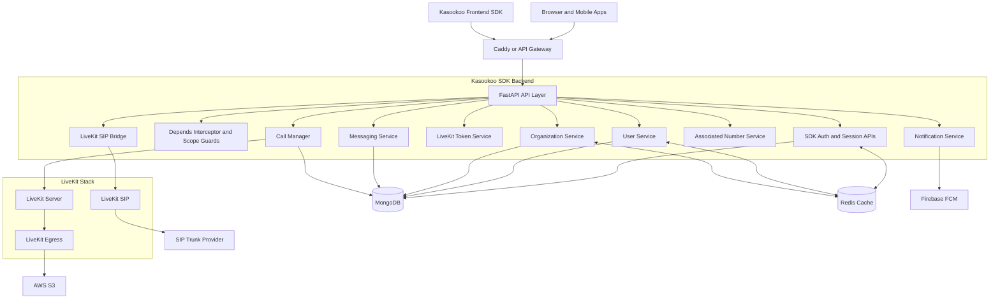
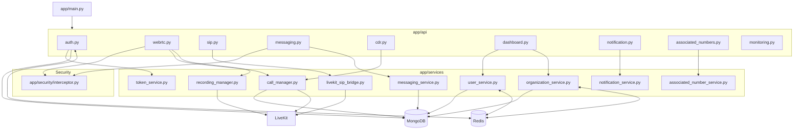
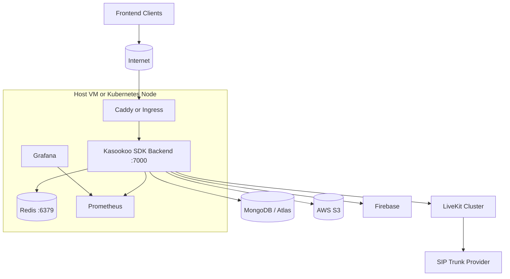
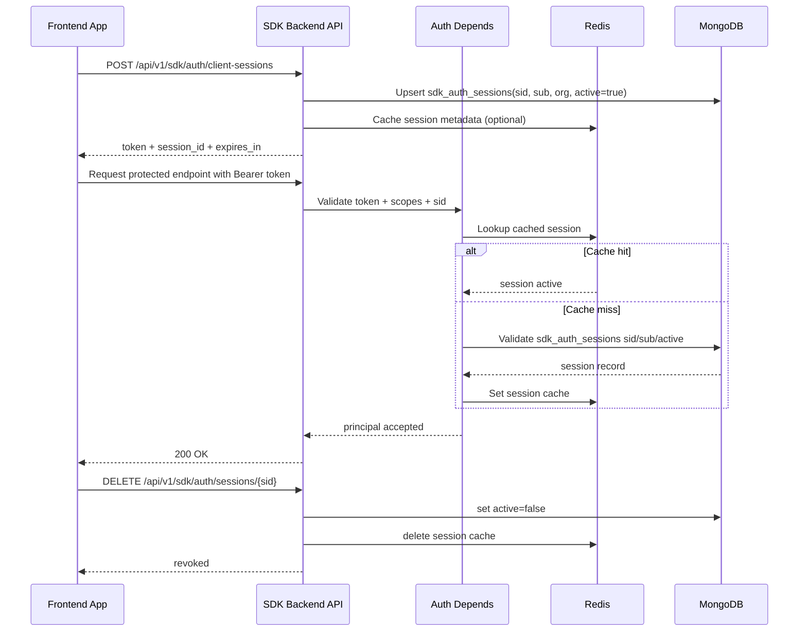
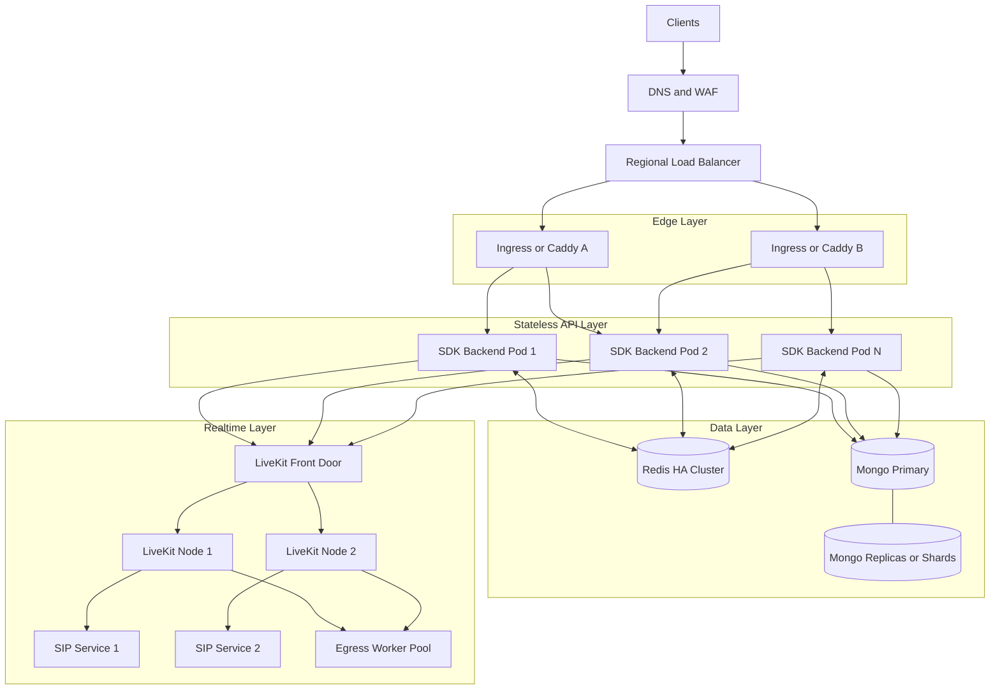

# System Architecture

This document describes the architecture of the Kasookoo SDK Backend, including runtime components, deployment topology, and authentication/session flow.

## 1) High-Level System Architecture

### Explanation

- Clients access the backend through API gateway/Caddy.
- FastAPI routers use dependency-based auth/interceptor checks before business handlers.
- MongoDB is the source of truth for sessions, users, organizations, calls, and messaging.
- Redis is a cache layer for session, user, and organization hot-read paths.
- LiveKit handles media sessions; SIP flows route via LiveKit SIP; recordings are exported to S3.

## 2) Component Diagram (Code Structure)

## 3) Deployment Architecture

## 4) SDK Auth + Session Flow

## 5) Scalable Architecture (Target)

